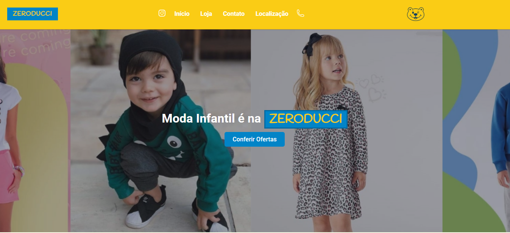

# 👶🛍️ Zeroducci – Kids' Fashion Online Catalog

**Zeroducci** is an online catalog that showcases a stylish and playful selection of children's clothing in a responsive and visually appealing format. Built using **HTML5**, **CSS3**, **JavaScript**, and **Tailwind CSS**, the project delivers a structured layout, modern design, and interactive user experience — perfect for parents and guardians looking for the best in kidswear.

---

## 🌟 Key Features

- 📱 **Responsive Layout**  
  Looks great on mobile, tablet, and desktop devices with fluid, flexible design.

- 🎨 **Modern UI**  
  Clean, elegant styling powered by Tailwind CSS for consistency and ease of customization.

- 🧠 **Interactive Experience**  
  JavaScript enables dynamic features like product hovers, filters, and smooth navigation.

- 🧒 **Kid-Friendly Catalog**  
  Visually engaging product presentation for various categories of children’s clothing.

- ⚙️ **Modular and Maintainable**  
  Well-organized codebase using semantic HTML and reusable Tailwind classes.

---

## 🛠️ Tech Stack

- **HTML5** – Semantic and accessible markup.
- **CSS3** – Styling foundation and fallbacks.
- **JavaScript (Vanilla)** – Adds interactivity and logic.
- **Tailwind CSS** – Utility-first framework for responsive, clean design.

---

## 📸 Preview

---

## 🚀 Getting Started

To run the project locally:

1. **Clone the repository:**
   \`\`\`bash
   git clone https://github.com/your-username/zeroducci-catalog.git
   cd zeroducci-catalog
   \`\`\`

2. **Open the HTML file in your browser:**
   You can use a live server extension or just double-click \`index.html\`.

3. **(Optional) Build Tailwind CSS:**
   If you're using Tailwind via CLI:
   \`\`\`bash
   npx tailwindcss -i ./css/input.css -o ./css/styles.css --watch
   \`\`\`

---

## 🧩 Customization Ideas

- Add categories (e.g., Newborn, Toddler, Pre-Teen)
- Implement product filters by age, size, or price
- Include a product detail modal or page
- Integrate a shopping cart for e-commerce functionality

---

## 📌 Roadmap

- [ ] Add search and filter options  
- [ ] Include animations for hover effects and transitions  
- [ ] Create backend integration for dynamic content  
- [ ] Add user login and checkout flow  

---

## 📄 License

This project is licensed under the [MIT License](LICENSE).

---

## 🤝 Contributing

Feel free to fork this repository and submit pull requests. Suggestions and improvements are always welcome!