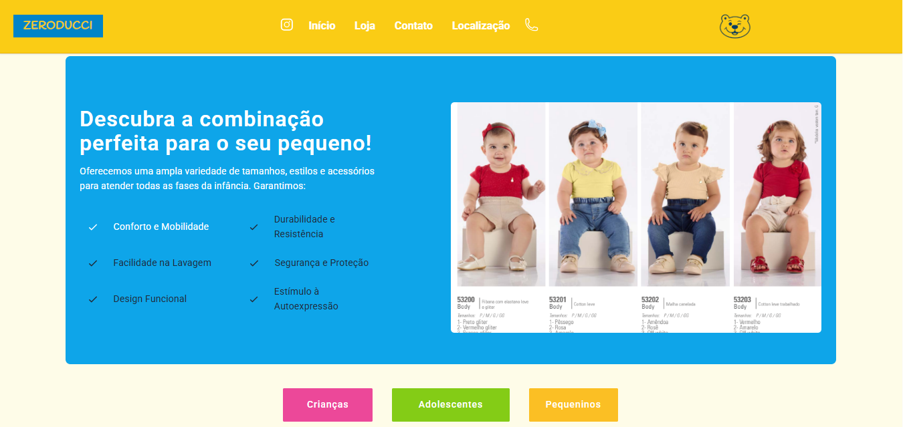
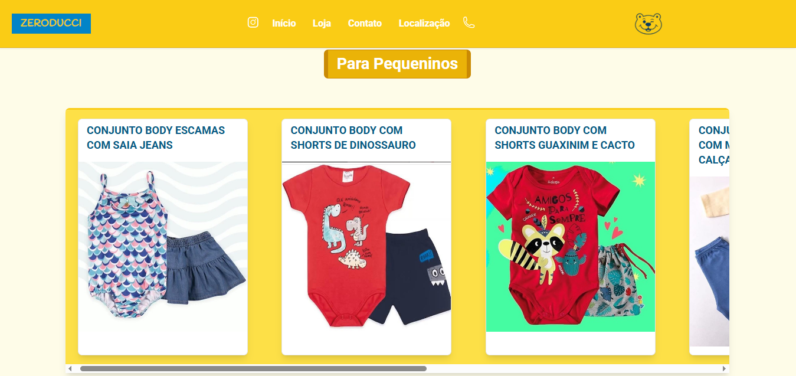

# 👶🛍️ Zeroducci – Catálogo de Moda Infantil Online

**Zeroducci** é um catálogo online que apresenta uma seleção estilosa e divertida de roupas infantis em um formato responsivo e visualmente atraente. Desenvolvido com **HTML5**, **CSS3**, **JavaScript** e **Tailwind CSS**, o projeto oferece um layout estruturado, design moderno e uma experiência interativa — ideal para pais e responsáveis em busca do melhor da moda infantil.

---

## 🌟 Principais Funcionalidades

- 📱 **Layout Responsivo**  
  Aparência perfeita em dispositivos móveis, tablets e desktops com design fluido e adaptável.

- 🎨 **Interface Moderna**  
  Estilo limpo e elegante impulsionado pelo Tailwind CSS para consistência e fácil personalização.

- 🧠 **Experiência Interativa**  
  JavaScript adiciona recursos dinâmicos como efeitos ao passar o mouse, filtros e navegação suave.

- 🧒 **Catálogo Amigável para Crianças**  
  Apresentação visual envolvente de produtos para diversas categorias de roupas infantis.

- ⚙️ **Código Modular e Manutenível**  
  Base de código bem organizada utilizando HTML semântico e classes reutilizáveis do Tailwind.

---

## 🛠️ Tecnologias Utilizadas

- **HTML5** – Marcações semânticas e acessíveis.  
- **CSS3** – Estilo visual base e compatibilidade.  
- **JavaScript (Vanilla)** – Interatividade e lógica de front-end.  
- **Tailwind CSS** – Framework utilitário para design limpo e responsivo.

---

## 📸 Prévia

  
  
  

---

## 🧩 Ideias de Personalização

- Implementar filtros de produtos por idade, tamanho ou preço  
- Incluir modal ou página de detalhes do produto  
- Integrar um carrinho de compras para funcionalidade e-commerce  

---

## 📌 Planejamento

- [ ] Adicionar opções de busca e filtro  
- [x] Incluir animações em efeitos e transições  
- [ ] Criar integração com backend para conteúdo dinâmico  
- [ ] Adicionar login de usuário e fluxo de finalização de compra  

---

## 📄 Direitos Autorais

**ZERODUCCI © 2025** - Todos os direitos reservados. Este conteúdo é propriedade da **ZERODUCCI** e **não** pode ser **reproduzido**, **distribuído** ou **utilizado sem autorização prévia**.

---

## 👥 Colaboradores

- [Heitor Carnielo Janko](https://github.com/HelloBigBoi124)  
- [Gabriel Soares](https://github.com/Gabriel485s)